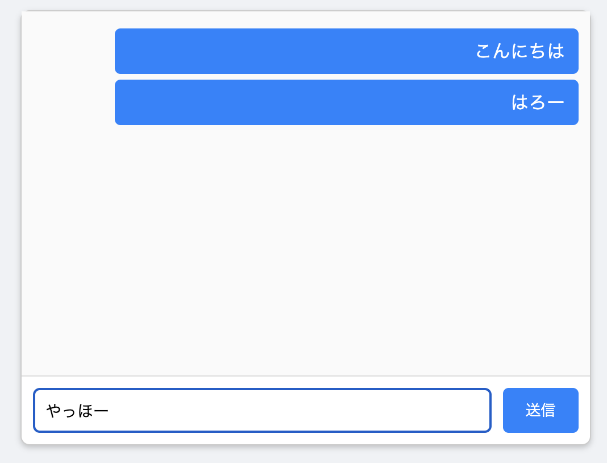

# JavaScriptをはじめよう
JavaScriptでのプログラミングを始めるためのサンプルを用意しました。
ChromeなどのブラウザとNode.jsで動作するものを用意する予定ですが、今のところはChrome版のみです。

## Chromeで動くチャット風画面
### 動かし方
Chrome上でチャット風画面（実際にメッセージを送ることはできません、画面だけです）をJavaScriptで実現しました。次の手順で試せます。

1. [まず、ここをクリックして"lets_start_javascript-main.zip"をダウンロードします](https://github.com/kwaka1208/lets_start_javascript/archive/refs/heads/main.zip)
2. ダウンロードされた"lets_start_javascript-main.zip"を展開します。Windowsの場合はファイルの上で右クリックして必「すべてを展開」で展開してください。
3. 展開してできたフォルダの中にbrowserフォルダがあります。この中のindex.htmlをダブルクリックしてください。
4. チャットのような画面が表示されますので、何かメッセージを入力して「送信」ボタンを押してください。繰り返しますが、実際に送信は行われません。

### プログラムについて
ソースコードは先ほど展開したフォルダの中の以下のファイルです。

- index.html：ブラウザ上の画面を作るファイルです
- style.css ：色などの見た目を決めるファイルです
- script.js ：JavaScriptのプログラムファイルです

いきなりは難しいかもしれませんが、一度見てみてください。

## Node.jsのサンプルプログラム
現在準備中です

## 参考リンク
### ドキュメント
- [JavaScript ガイド - JavaScript | MDN](https://developer.mozilla.org/ja/docs/Web/JavaScript/Guide)
- [JavaScript リファレンス - JavaScript | MDN](https://developer.mozilla.org/ja/docs/Web/JavaScript/Reference)
- [とほほのJavaScript入門 - とほほのWWW入門](https://www.tohoho-web.com/js/index.htm)

### ツール・サービス
- [Node.js — Run JavaScript Everywhere](https://nodejs.org/en)
- [Glitch: The friendly community where everyone builds the web](https://glitch.com/)
- [p5.js](https://p5js.org/)